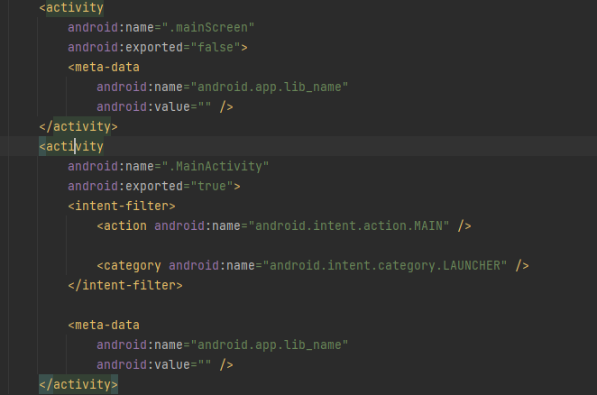
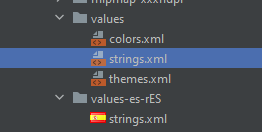
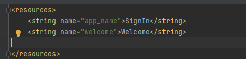
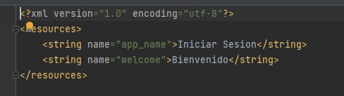

#  Breu memòria
### • Sobre el codi de les activitats
1.  Indica com accedeixes als diferents elements de la interfície

<!-- >Lo primero que he hecho he entrado en la clase MainActivity he declarado tres variables constantes. Username, password y los intentos. -->
>He declarado tres variables donde almaceno los datos introducido por el usuario.<br>
Estos variables inputUsername y inputPassword donde el usuario ha introducido su username y su password.
Accedemos a estos elementos usando el findViewById con el tipo de el elemento y su ID por ejemplo editTextTextUsername y editTextTextPassword.Tambien el mismo caso con los intentos.

Ejemplo :
```
val inputUsername=findViewById<EditText>(R.id.editTextTextUsername)
val inputPassword=findViewById<EditText>(R.id.editTextTextPassword)
val textview=findViewById<TextView>(R.id.textViewAttempts)
```
---
2. Indica com has realitzat la navegació entre una activitat i altra

    >He declarado un variable btLogin para saber cuando el usario ha pulsado button login saber si ha introducido los datos correctos , sacamos su username y su password usando el .getText().toString() sobre los variables de primer ejemplo y comprobar si son los mismos que tenemos en nuestra configuracion .Sino aumentar los intentos hasta 3 y se sale de la aplicación. Si todo bien pasamos a la otra Activity mainScreen llevando el nombre de usuario usando Intent.

    ```
    val btLogin=findViewById<Button>(R.id.btLogin)
    btLogin.setOnClickListener{
                if(inputUsername.getText().toString()==username&&inputPassword.getText().toString()==password)
                {
                    val intent = Intent(baseContext, mainScreen::class.java)
                    intent.putExtra("username", inputUsername.getText().toString())
                    startActivity(intent)
                }else{
                    intentos++
                    if(intentos<=3)
                    {
                        textview.setText("Failed Attempts:"+intentos.toString())
                    }else
                    {
                        finish()
                    }
                }
            }
    ```
    >Y para sacar el nombre de usuario en la nueva Activity usamos intent.getStringExtra("username") y lo mostramos en el textView de user.
    ```
    val username:String? = intent.getStringExtra("username")
    val textViewUsername=findViewById<TextView>(R.id.textViewUsername)
    textViewUsername.setText(username.toString())
    ```
---
### •  Sobre el fitxer Manifest, investiga el següent:
1. Quantes activitats apareixen configurares? Mostra-les i indica les principals diferències
entre elles i què signifiquen.

    >Como veremos tenemos dos Activities MainActivity y mainScreen. Todas son iguales solamente en intent-filter no tiene el mainScreen.Y el android:exported esta en False no en True.

    

2.  Observa l’atribut android:exported en elles i investiga en la documentació d’Android
què significa i quines repercusions té el seu valor en l’aplicació.

    >Android:exported  : Este elemento establece si los componentes de otras aplicaciones pueden iniciar la actividad. Si es *True cualquier app puede acceder a la actividad y se puede iniciar con su nombre de clase exacto.*  y si *False la actividad solo se puede iniciar con componentes de la misma aplicación Este es el valor predeterminado cuando no hay filtros de intents.* 


### •  Sobre les traduccions realitzades:

1. __Vista de Android__


<br>
2. __Vista de los archivos del proyecto__


<br>

>Se añadido otro directorio de Traduccion values-es con nuevo fichero xml de strings en español en vista de archivos. Y en android solamente se añadido el fichero xml.
    
Su contenido:<br>
Antes de traduccion
<br>
<br>
Y despues de Cambiar la idioma en el telefono <br>

    


