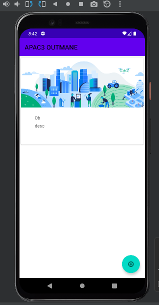
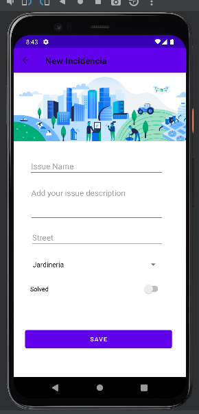
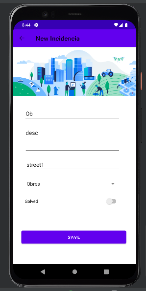
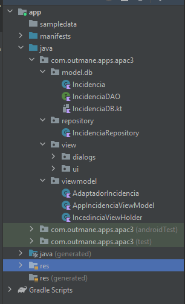
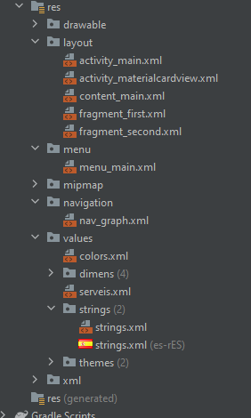
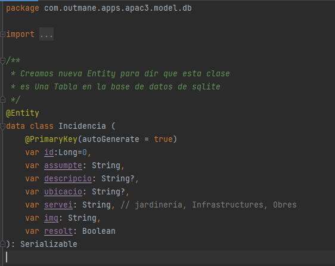
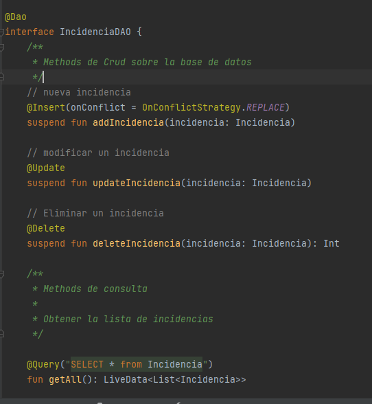
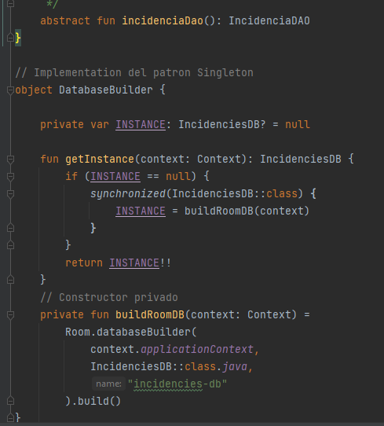
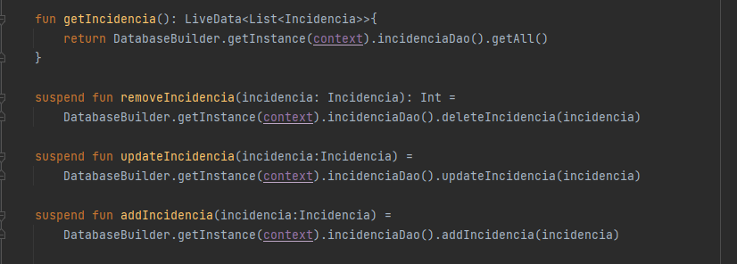
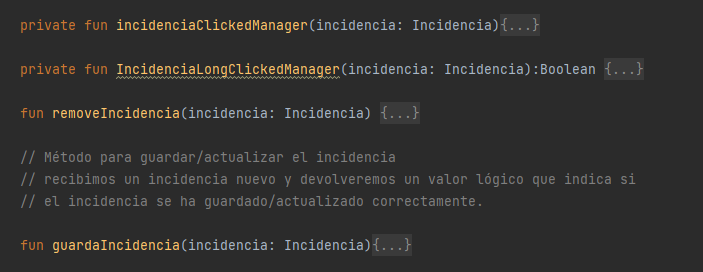

#  Breu memòria
## Layouts
Así tenemos la nuestra aplicación cuando lo arrancamos. Por la primera vez no se muestra nada porque la base de datos está vacía, no hemos insertado ninguna incidencia. El First Fragment es el punto de entrada de la aplicación que tiene la opción de pasar a la segunda página o borrar una incidencia y Second Fragment para insertar una nueva incidencia o modificarla si hemos hecho un clic sobre una incidencia concreta.

First Fragment            |  Second Fragment           |  Editar la incidencia
:-------------------------:|:------------------------:|:-------------------------:
  |   |  

## Estructura de directorios
1. Como podemos ver en las imágenes que tenemos muchos directorios para hacer el modelo de MVVM que los hagamos para controlar cada parte de aplicación y cambiar el código en una parte para que no afecta al resto del código después cuando ya tenemos todo programado tenemos que juntarlo para que funcione toda la aplicación.
2. la segunda imagen vemos los layouts que he creado las vistas para mostrar las incidencias y pasar entre fragments (página a página). Y también he añadido la traducción de la aplicación, Y con esto funciona la aplicación. 

Código de Incidencia         | Directorio de Vistas             
:-------------------------:|:------------------------:
  |   |

## Parte de base de datos
1. Declaramos los variables de la incidencia y lo declaramos como Anotación Entity esto sirve para que se crea en la base de datos una Tabla Incidencia con estos campos en SQLite.

    

2. Un interface de DAO de incidencia contiene todos los métodos de actualización y consulta sobre una base de datos para insertar,modificar,borrar y finamlente hacer un select sobre toda la tabla incidencia.

    

3. Y finalmente creamos la base de datos usando el patron singleton .

    

4. Hemos implementado también un repositorio que sirva como punto de acceso al modelo, y que ofrezca una
API en ViewModel para que éste pueda acceder a los datos.

    

## Parte del ViewModel
esta programada en tres partes : 

* AdaptadorIncidencia: Creamos el ViewHolder y saber cuando se inicia el event a la hora de clic normal o long clic.
* AppIncidenciaViewModel
* IncidenciaViewHolder

ViewModel Sirve para mostrar las incidencias usando (un RecyclerView) y otro para editarlas/añadirlas. 
ViewModel tiene el concepto de almacenar en caché el estado y lo conserva durante los cambios de configuración. Esto significa que la ui no tiene que recuperar datos cuando navegas entre actividades o si sigues cambios de configuración, como cuando rotas la pantalla.

